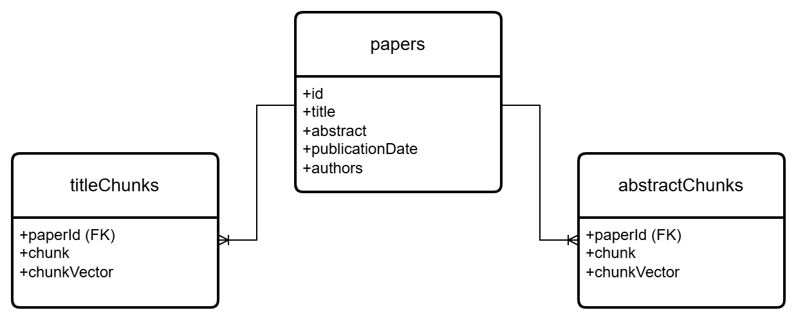

# Semantic_Search_Project
This document describes the project that represents a semantic search engine
specialized in papers that deal with long-term care.
The following describes the structure of the project with the description of its parts.

## Used technologies
 


## Used paper sources
The following picture depicts the scientific paper sources used 
to fetch and prepare scientific papers.
The picture also depicts the data exchange formats of their APIs.


## DataPreparation
This folder contains code that was used to prepare data for the semantic search engine.
Also different models (sentence transformers) were compared.
```
│   
│      
│
└───APIHandlers
│   
│   
└───DataPreparators
│   
│       
└───ETLPipelines
│
│
└───Services
│
│
|   
│   main.ipynb
```

### main.ipynb
The main description of the data preparation.
**Please read this notebook**.
The notebook contains information about pipelines and preparation steps
that were undertaken to prepare the data for the semantic search engine.
All modules in the subfolders of the project were explained in the code documentation.
**Please do not execute this notebook again.**


### APIHandlers
This folder contains modules that communicate with APIs of external scientific paper databases (arXiv and Semantic Scholar).

### DataPreparators
This folder contains modules that prepare data fetched using API handlers from scientific paper databases (arXiv and Semantic Scholar).

### ETLPipelines
This folder contains ETL pipelines used to extract, transform and load different kinds of data.
The following pipelines were implemented.
* arXiv API (Extract) -> Remove duplicate papers and papers with missing titles and abstracts (Transform) -> Load papers to MongoDB (Load)

* Semantic Scholar API (Extract) -> Remove duplicate papers and papers with missing titles and abstracts (Transform) -> Load papers to MongoDB (Load)

* MongoDB Papers (Extract) -> Perform abstract chunking, chunk preprocessing, chunk embedding (Transform) -> Load chunks to MongoDB (Load)

* MongoDB Papers (Extract) -> Perform title chunking, chunk preprocessing, chunk embedding (Transform) -> Load chunks to MongoDB (Load)


### Services
This folder contains modules that encapsulate the business logic used to communicate with the MongoDB database,
to preprocess data and to embed data.

## ER diagram of the MongoDB database model
The following picture depicts how data (papers and their title and abstract chunks)
was stored in the MongoDB database.


## Backend
This folder contains the **FastAPI** application that was used to abstract the semantic search engine
for the frontend application.
It relies on the classical REST-API structure.
```
│   
│      
│
└───models
│   
│   
└───routers
│   
│       
└───services
│
│
|   
│   main.py
```

### main.py
Contains the main entry point of the REST-API project.
Run **uvicorn main:app --reload** to start the REST-API.

### models
Contains modules that abstract the main business logic data.
This represents request bodies, response bodies and models representing chunks, papers and authors.

### routers
Represents modules that encapsulate API controllers with HTTP methods
that can be called from different client applications.
The main controllers are controllers for the semantic/lexical search in abstracts and titles.

### services
This folder contains modules that encapsulate the business logic used to communicate with the MongoDB database,
to preprocess data and to embed data.

## Frontend
This folder contains the frontend application programmed with **Gradio**.
```
│   
│      
│
└───models
│   
│       
└───services
│
│
|   
│   main.py
```

### main.py
Contains the main entry point of the frontend application.
Run **python main.py** to start the application.

### models
Contains modules that abstract the main business logic data.
These are models representing chunks, papers and authors.

### services
This folder contains modules that encapsulate the business logic used to communicate with the REST-API (backend in **FastAPI**) used to serve
the semantic engine for the application.

## System architecture
The following picture summarizes the architecture of the whole process
and system.


## Run the project
1. Create a MongoDB cluster. 
2. Create a .env file in the [root](./DataPreparation/) of the data preparation project 
and the [root](./Backend/) of the backend project.
3. Create the following variables in the .env files: MONGODB_URL=YOUR-CLUSTER-URL.
4. Navigate to the [data preparation project](./DataPreparation/) and execute the file **main.ipynb**.
5. Navigate to the [backend project](./Backend/) and execute the file **main.py** using **uvicorn main:app --reload**.
6. Navigate to the [frontend project](./Frontend/) and execute the file **main.py** using **python main.py**. You can change the URL
of the backend in the [config.py](./Frontend/config.py) file.
7. Navigate to the URL of the frontend application in your browser (see the terminal).

## Some screenshots
Lexical search in titles (search query: health system)

Lexical search in abstracts (search query: health system)

Semantic search in titles (search query: european healthiness system)

Semantic search in abstracts (search query: very exhausted)
